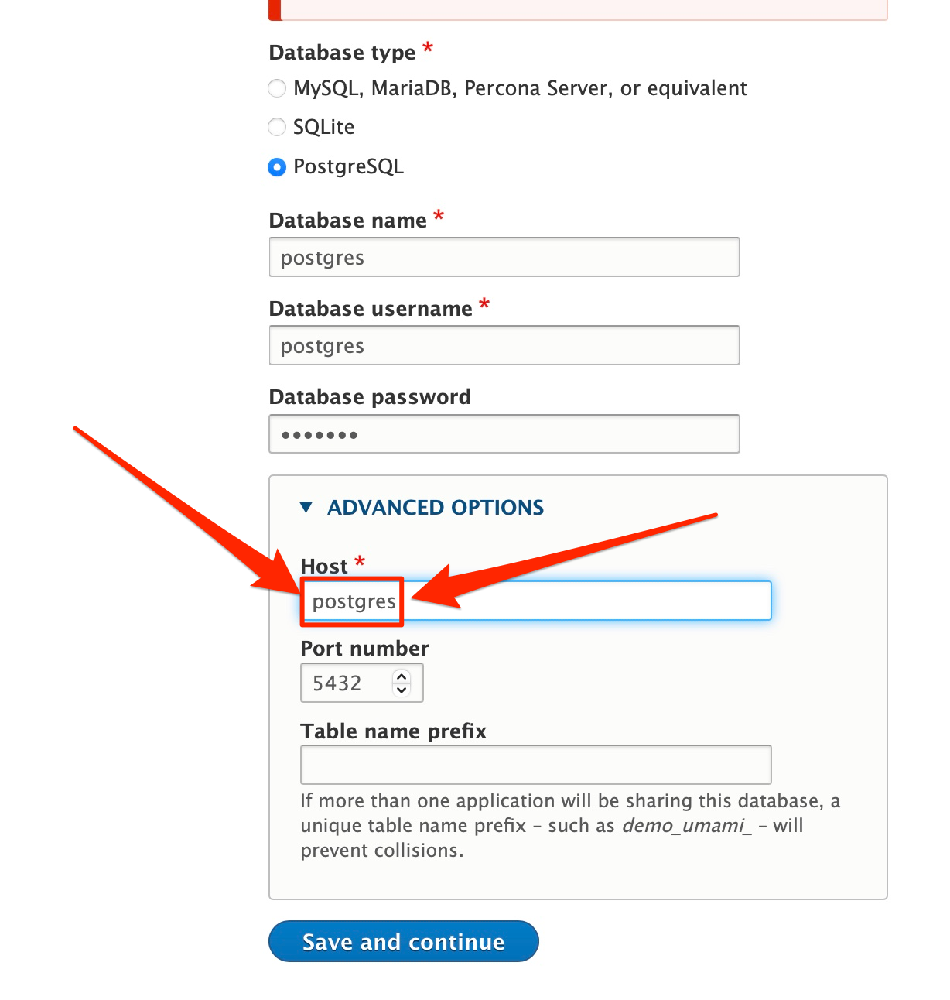

# drupal

## Outstanding Actions

* How do I get my drupal named volumes working?
## Instructions

Note I've used the docker-compose.yaml file from [drupal on docker hub](https://hub.docker.com/_/drupal) with a few additions:  I added named volumess for one.

Before running ``docker-compose up`` for the first time, you need to manually create the 4 named volumes; otherwise startup will fail.  To do this run the ``./setup.sh`` which will delete any exiting containers and then create the 4 volumes if they don't already exist.  Passing the ``-c`` flag will force the volumes to be deleted if they already exist, i.e., ``./setup.sh -c``.  **CAREFUL HERE!**  The ``-c`` will remove all docker volumes.

```bash
./setup.sh
docker-compose up -d
```

Log onto <http://localhost:8080> and begin setting up Drupal.

Ensure that the database host is NOT ``localhost`` but the service name of the running postgres container, e.g., ``postgres``.  This is the DNS name for the postgresql container on this docker network
